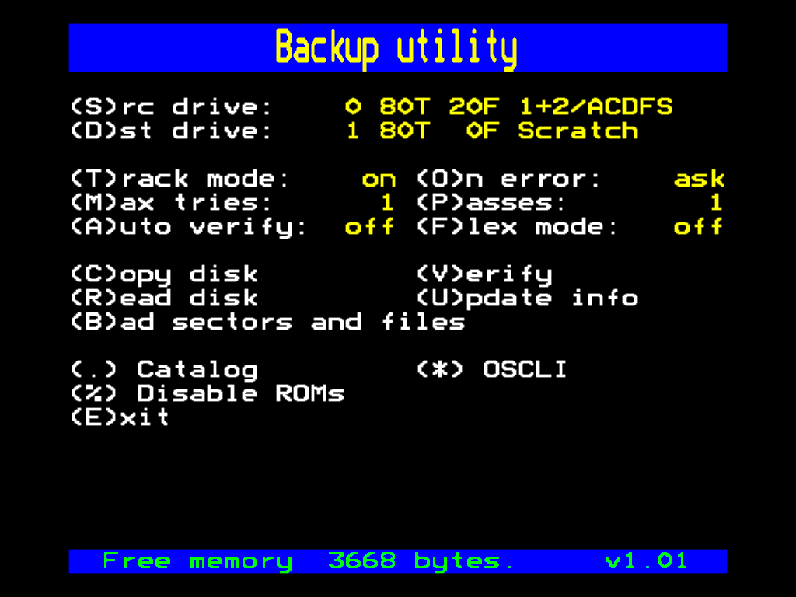
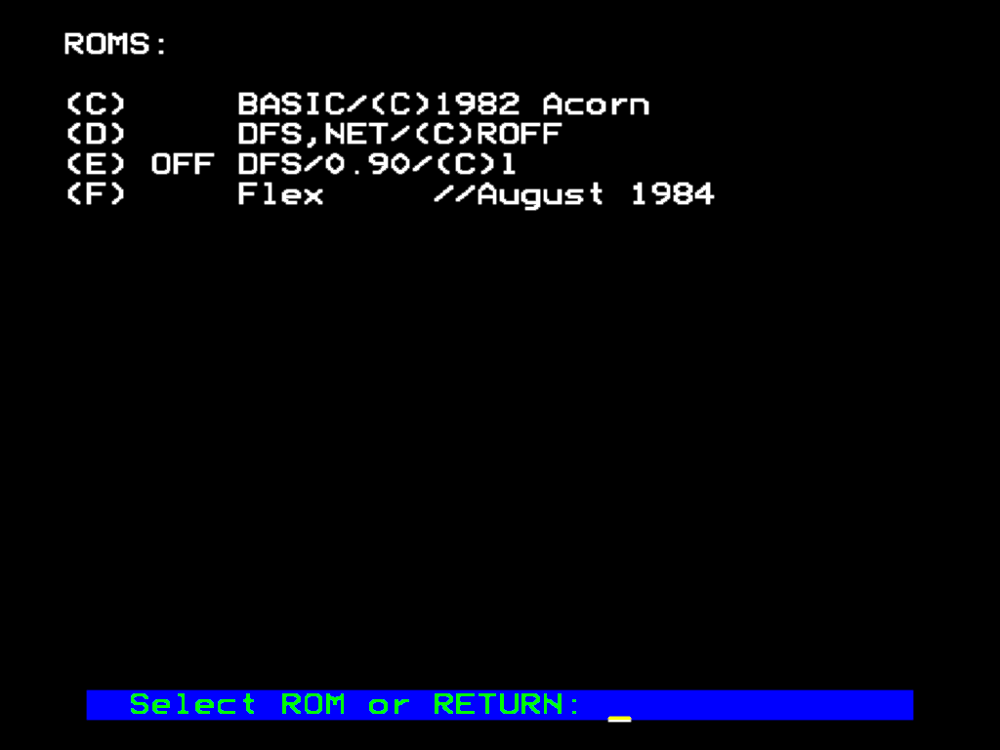
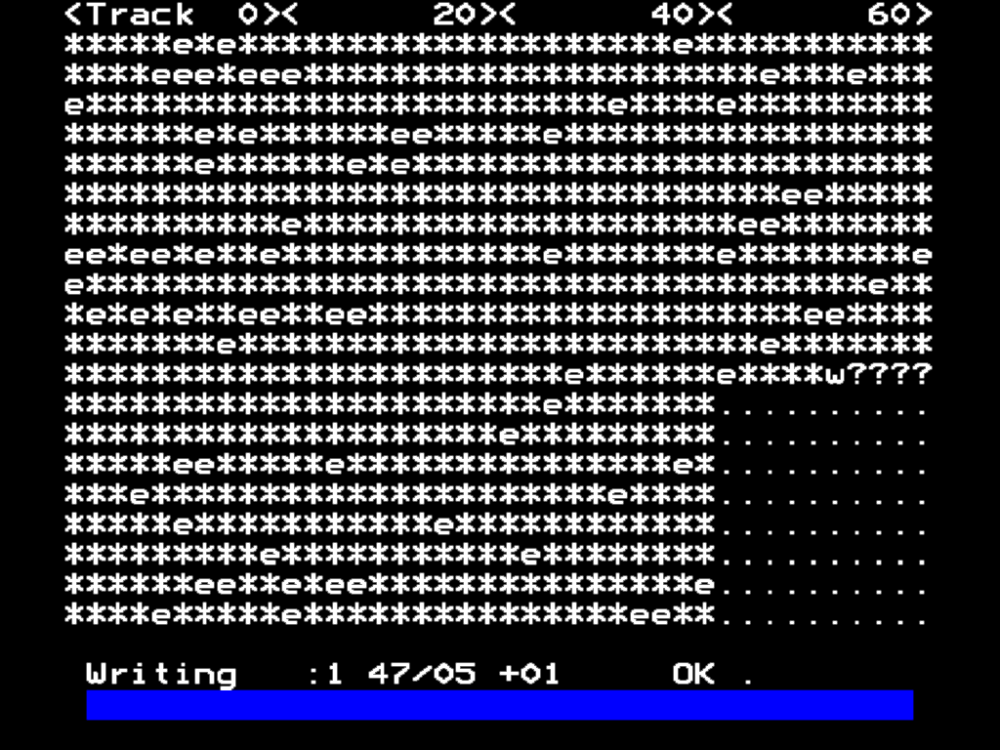
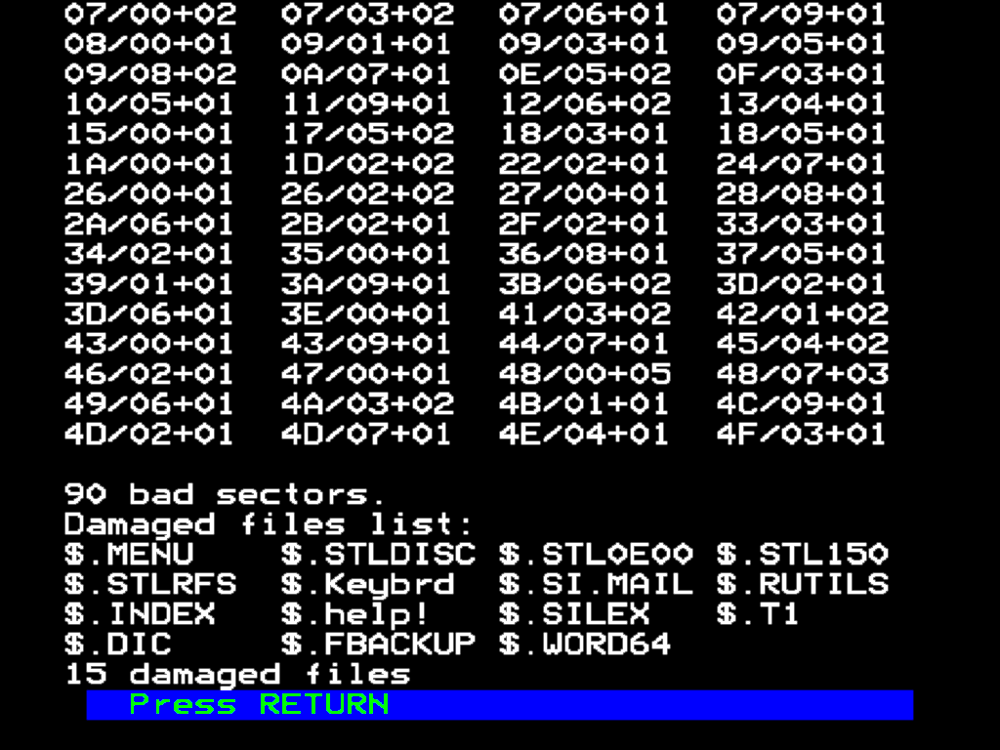

# beebutils
Utilities for BBC Micro (Model B)

## butil.bas
BBC Basic program from copying floppies en masse. It basically duplicates functionality of ``*BACKUP`` command, but does it in style.

Features:
* Display progress graphically
* Retry or skip bad sectors
* Display list of bad sectors and files to which those sectors belong
* Disable selected ROMs to allow copying DFS disks while MMC ROM is present in the system and vice-versa. Unfortunatelly it
  doesn't allow copying data between physical drive and MMC.
* Copying exotic FLEX OS disks

### main menu


* ``S`` - Select source drive number. Displayed info is: number of tracks, number of files in catalog and disk title
  or error number if an error was encountered during catalog sectors read.
* ``D`` - Select destination drive number.
* ``T`` - Track mode - read a track at a time and if that fails, try to read each sector on a track separately. There is
  no reason to turn it off.
* ``O`` - On error - action taken when bad sector is encoutered. Cycles between ``ask``, ``continue`` and ``fail``.
* ``M`` - Max tries - max. number of times each disk operation is attempted before giving up.
* ``P`` - Passes - max. number of retries for copy. Effective number of attempted reads or writes is ``passes * max. tries``.
* ``A`` - Auto verify - verify data during copy operation.
* ``F`` - Flex mode - for copying CMS Flex disks.
* ``C`` - Copy disk
* ``V`` - Verify - read and compare source and destination disks track by track.
* ``R`` - Read disk - read source disk and check for bad sectors.
* ``U`` - Update info - read catalog sectors and update data displayed and ``'(S)ource'`` and ``(D)estination`` lines.
* ``B`` - Bad sectors and files - display list of bad sectors found during last operation.
* ``.`` - Catalog - display disk catalog
* ``*`` - OSCLI - execute arbitrary OSCLI command. Be carefule not to use a commands which overwrites BASIC program memory,
  such as ``*BACKUP``
* ``%`` - Toggle selected ROMs off and on. Useful when you have both (A)DFS and MMC ROMs installed.
* ``E`` - Exit program

### toggle ROMs


Displays list of installed ROMs. Select ROM by hex number to toggle it on to off. ROMs are disabled by clearing memory location
``&2A1+rom``, this prevents MOS from dispatching ``OSWORD`` call ``&7F`` (low-level disk access) to those disabled ROMs. Initial
values are automatically restored when program exits.

In the screenshot above, the Super MMC ROM has been disabled to allow copying DFS disks.

### disk operation screen


Each character represents single sector, horizontal strip of ten characters represents one track. Tracks are layed out from top-left,
down the screen and the to the right, in four columns. Meaning of the characters is:

* ``.`` - sector not read yet
* ``r`` - reading
* ``w`` - writing
* ``v`` - verifying
* ``e`` - error
* ``?`` - program couldn't copy entire track at once, now copying sector by sector

To abort the operation, press ESCAPE key. You may have to try several times, because ESCAPE is active only during disk access.

### list of bad sectors and files


Displays list of bad sectors, followed by list of files to which those sectors belong. Format of record on bad sectors list is track /
sector + number of consecutive bad sectors.

### copying CMS FLEX disks to GOTEK

I happen to be in possesion of a CMS-6809 second processor board which came along with ROM, presenting itself as ``CMS Flex`` and a few
floppies with the Flex operating system. The format of those floppies is similar to the format of standard DFS floppies, but
with a different sector numbering scheme - sectors on th first side are numbered from 1 to 10, in contrast to standard 0 to 9, and
sectors on the second side are numbered 11 to 20, in contrast to repeated numbers 0 to 9. Those differences make it impossible to 
copy those floppies using standard ``*BACKUP``, and this program also cannot handle those floppies in standard mode.

A new mode has been added specially for those floppies. In this mode the utility uses modified sector numbering scheme, to match this
of the Flex OS. The target floppy still has to be properly formatted using Flex' ``NEWDISK`` or Flex ROM's ``*FLEX FORMAT`` command.

When copying double sided floppies, remember that despite the modified sector numbering, the ``BUTIL`` still sees each side of the
floppy separately, and after first side is copied, e.g. from drive 0 to 1, second side must be copied separately -
from drive 2 to 3.

It is also possible to copy such Flex floppies to a GOTEK drive, but not to a standard ``.ssd`` file, as this assumes default
sector numbers. Instead a specially prepared ``.hfe`` file must be used.

To create such an image file, use HxC Floppy Emulator - select ``Load custom RAW file/Create custom floppy`` and enter following 
parameters (values marked with asterisk are those values that are different from standard DFS format):

```cfg
Track type: FM
Number of Track: 80
Number of side: 2 Sides
Track of a side grouped in the file: No
Bitrate: 250000
Sector side: 256 bytes
Reverse side: No
RPM: 300
Sector ID start: 1  *
Inter side sector numbering: Yes  *
Interleave: 0
Skew: 0
Side based: False
Total Sector: 1600
Total Side: 409600
Format value: 246
GAP3 length: 16
Auto GAP: No
PRE-GAP length: 0
```
... and click ``Create empty floppy``. Then select ``Export disk / Save As`` from menu, as save the file to your GOTEK pendrive
using the default ``HFE`` file type.

When copying data from double sided floppy disk to GOTEK, again, don't forget to copy both sides.

## building

### Linux and MinGW

```shell-session
~/src$ git clone https://github.com/monkeyman79/beebutils.git
~/src$ cd beebutils
~/src/beebutils$ make
```

### Windows
```
...\src> git clone https://github.com/monkeyman79/beebutils.git
...\src> cd beebutils
...\src\beebutils> make.cmd
````

This will build prerequisite 'beebasm' in a build/beebasm subdirectory, and
produce a new bootable floppy image `butil.ssd` in current directory.

